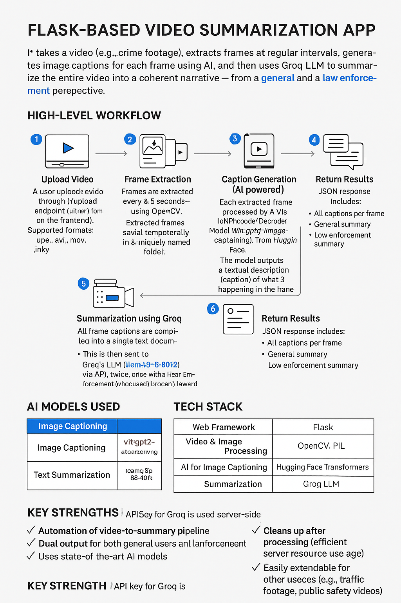

# 🎥 Video to Narrative (Crime Scene Caption + Summary AI)



A Flask-based AI application that:
- Extracts frames from uploaded videos
- Captions frames using ViT-GPT2 (transformers)
- Transcribes audio using Whisper
- Summarizes visuals + audio using **Groq LLM (llama3-8b-8192)**

## 📁 Project Structure
```
video_to_narrative/
├── app.py                 # Main Flask backend
├── logs/
│   └── app.log            # Runtime logs
├── uploads/               # Temporary video + frames (ignored in Git)
├── audio/                 # Temporary audio files (ignored in Git)
├── templates/
│   └── index.html         # Frontend upload page
├── v2t/                   # Virtual environment (ignored in Git)
├── .gitignore
├── requirements.txt
├── README.md
```

## ✅ Features

- ✅ Upload crime/dashcam/bodycam video
- ✅ Frame-by-frame captioning (ViT-GPT2)
- ✅ Audio transcription (Whisper)
- ✅ Groq-powered dual summary:
  - General Summary
  - Law Enforcement Report

## 🚀 Setup Instructions

### 1. Clone the repo

git clone https://github.com/ChaituRajSagar/video_to_narrative.git

cd video_to_narrative

### 2. Create Python environment

python -m venv v2t

v2t\Scripts\activate  # On Windows

Or 

source v2t/bin/activate  # On macOS/Linux

### 3. Install dependencies

pip install -r requirements.txt

### 4. Set your Groq API Key

Create a `.env` file (or set directly in `app.py`):

GROQ_API_KEY=your_groq_api_key_here

## ▶️ Run the App

python app.py

Visit [http://127.0.0.1:8009](http://127.0.0.1:8009)

## 🛑 Notes

* Uses CPU by default (Torch auto-detects)
* Auto-cleanup of:

  * Extracted frames
  * Uploaded video
  * Audio files
* Logs available in `logs/app.log`