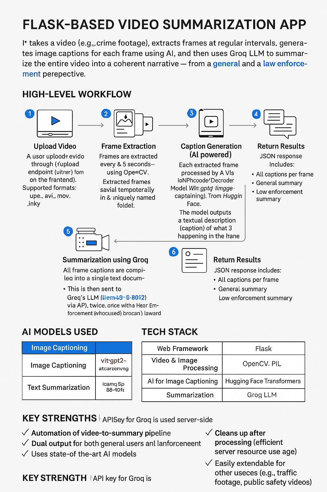

```markdown
# 🎥 Video to Narrative (Crime Scene Caption + Summary AI)


A Flask-based AI application that:
- Extracts frames from uploaded videos
- Captions frames using ViT-GPT2 (transformers)
- Transcribes audio using Whisper
- Summarizes visuals + audio using **Groq LLM (llama3-8b-8192)**

---

## 📁 Project Structure

```

video\_to\_narrative/
├── app.py                  # Main Flask backend
├── logs/
│   └── app.log             # Runtime logs
├── uploads/                # Temporary video + frames (ignored in Git)
├── audio/                  # Temporary audio files (ignored in Git)
├── templates/
│   └── index.html          # Frontend upload page
├── v2t/                    # Virtual environment (ignored in Git)
├── .gitignore
├── requirements.txt
├── README.md


````

---

## 🧪 Features

- ✅ Upload crime/dashcam/bodycam video
- ✅ Frame-by-frame captioning (ViT-GPT2)
- ✅ Audio transcription (Whisper)
- ✅ Groq-powered dual summary:
  - General Summary
  - Law Enforcement Report

---

## 🚀 Setup Instructions

### 1. Clone the repo

```bash
git clone https://github.com/yourusername/video_to_narrative.git
cd video_to_narrative
````

### 2. Create Python environment

```bash
python -m venv v2t
v2t\Scripts\activate  # On Windows
# Or
source v2t/bin/activate  # On macOS/Linux
```

### 3. Install dependencies

```bash
pip install -r requirements.txt
```

### 4. Set your Groq API Key

Either create a `.env` file:

```
GROQ_API_KEY=your_groq_api_key_here
```

Or paste the key directly in `app.py` (⚠️ not recommended for production).

---

## ▶️ Run the App

```bash
python app.py
```

Visit: [http://127.0.0.1:8009](http://127.0.0.1:8009)

---

## 🛑 Notes

* Uses CPU by default (Torch auto-detects)
* Uploaded files, extracted frames, and audio are auto-cleaned after processing
* Logs saved to `logs/app.log`

---

## 🧼 Auto-Cleanup

After every run, the app automatically deletes:

* Extracted frames
* Uploaded videos
* Extracted audio files

````

---

### ✅ `.gitignore` (if you haven’t already created):

```gitignore
__pycache__/
*.pyc
*.pyo
*.pyd
*.log

# Virtual Environment
v2t/

# Uploaded & generated content
uploads/
audio/
logs/

# System files
.DS_Store
.env
*.wav
*.mp4
*.avi
*.mov
*.mkv
````

---
